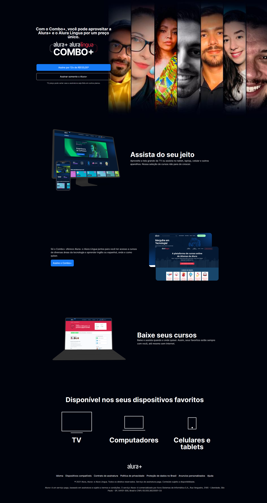

# Projeto do site Alura+

<h3 align="center"> 
    :construction:  Projeto em construção  :construction:
</h3>
 
## Site que estou desenvolvendo para praticar oque venho aprendendo com os cursos de programação da alura.

 

 

## :hammer_and_wrench: Ferramentas utilizadas:

* HTML

* CSS

## Feito por :

|[  Gabriel França ](https://github.com/dogonauta)
| :---: |

